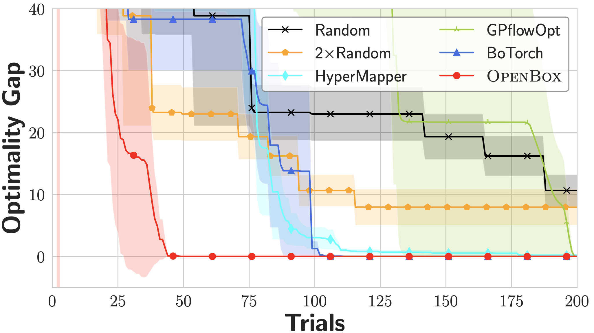
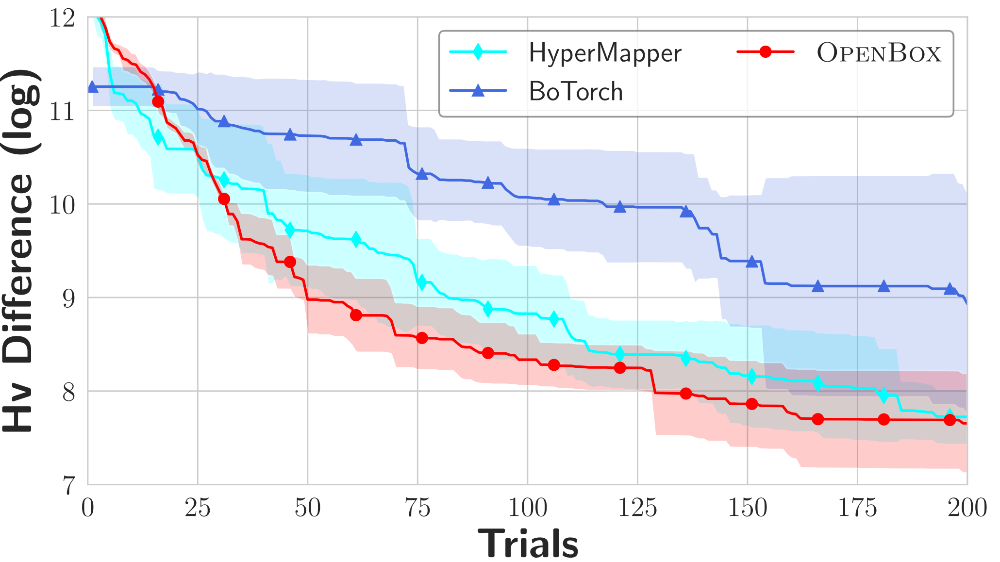
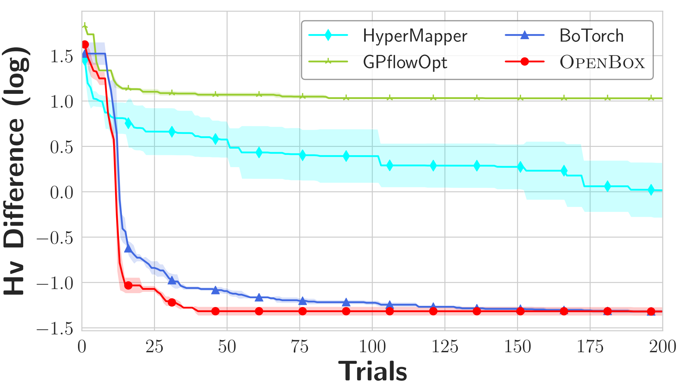
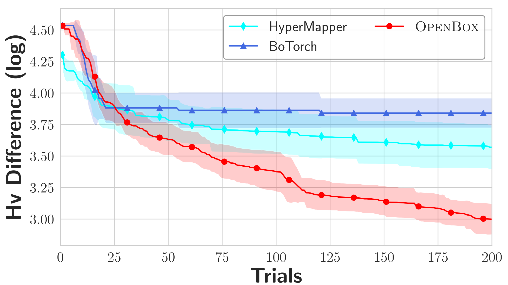

<p align="center">

</p>

-----------

[](https://github.com/thomas-young-2013/open-box/blob/master/LICENSE)
[](https://api.travis-ci.org/thomas-young-2013)
[](https://github.com/thomas-young-2013/open-box/issues?q=is%3Aissue+is%3Aopen)
[](https://github.com/thomas-young-2013/open-box/issues?q=is%3Aissue+is%3Aopen+label%3Abug)
[](https://github.com/thomas-young-2013/open-box/pulls?q=is%3Apr+is%3Aopen)
[](https://github.com/thomas-young-2013/open-box/releases)
[](https://gitter.im/bbo-open-box?utm_source=badge&utm_medium=badge&utm_campaign=pr-badge&utm_content=badge)
[](https://open-box.readthedocs.io/zh_CN/latest/index.html)


## OpenBox: 通用高效的黑盒优化系统
OpenBox是解决黑盒优化（超参数优化）问题的高效且通用的开源系统，支持以下特性：

1. 多目标与带约束的黑盒优化。
2. 迁移学习。
3. 分布式并行验证。
4. 多精度优化加速。
5. 早停机制。

## 使用方式

#### 本地Python包

用户可以安装我们发布的Python包，从而在本地使用黑盒优化算法。

#### 分布式黑盒优化服务

OpenBox是一个提供通用黑盒优化服务的系统。用户可以使用REST API便捷地访问服务，无需担心环境配置、代码编写与维护、执行优化等问题。用户还可以通过我们提供的网页用户界面，监控与管理优化任务。

## 设计理念

我们的设计遵循以下理念：
+ 易用：用户以最小代价使用黑盒优化服务，可通过用户友好的可视化界面监控与管理优化任务。
+ 性能优异：集成最先进（state-of-the-art）的优化算法，并可自动选择最优策略。
+ 资源感知管理：为用户提供基于成本（时间、并行数等）的建议。
+ 高效：充分利用并行资源，并利用迁移学习、多精度优化加速搜索。
+ 规模可扩展：对于输入维度、目标维度、任务数、并行验证数量等有较好的可扩展性。
+ 错误容忍、系统可扩展性、数据隐私保护。

## Links
+ [使用代码样例](https://github.com/thomas-young-2013/open-box/tree/master/examples)
+ [文档](https://open-box.readthedocs.io/zh_CN/latest/index.html)
+ [Pypi包](https://pypi.org/project/openbox/)
+ Conda包: [to appear soon]()
+ 博客: [to appear soon]()

## 应用教程
+ [使用OpenBox对LightGBM调参](https://github.com/thomas-young-2013/open-box/blob/master/docs/zh_CN/articles/openbox_LightGBM.md) 
+ [使用OpenBox对XGBoost调参](https://github.com/thomas-young-2013/open-box/blob/master/docs/zh_CN/articles/openbox_XGBoost.md)

## 性能实验结果

单目标优化问题

Ackley-4                  | Hartmann
:-------------------------:|:-------------------------:
  |  

单目标带约束优化问题

Mishra                  | Keane-10
:-------------------------:|:-------------------------:
  |  

多目标问题

DTLZ1-6-5             | ZDT2-3 
:-------------------------:|:-------------------------:
  |  

多目标带约束问题

CONSTR             | SRN 
:-------------------------:|:-------------------------:
  |  

## 安装教程

### 系统环境需求

安装需求：
+ Python >= 3.6 （推荐版本为Python 3.7）

支持系统：
+ Linux (Ubuntu, ...)
+ macOS
+ Windows

我们**强烈建议**您为OpenBox创建一个单独的Python环境，例如通过[Anaconda](https://www.anaconda.com/products/individual#Downloads):
```bash
conda create -n openbox3.7 python=3.7
conda activate openbox3.7
```

我们建议您在安装OpenBox之前通过以下命令更新`pip`和`setuptools`：
```bash
pip install pip setuptools --upgrade
```

### 通过PyPI安装（推荐）

使用以下命令通过PyPI安装OpenBox：

```bash
pip install openbox
```

### 通过源码手动安装

使用以下命令通过Github源码安装OpenBox：

（以下命令仅适用于Python >= 3.7，对于Python == 3.6，请参考[安装文档](https://open-box.readthedocs.io/zh_CN/latest/installation/installation_guide.html) ）

```bash
git clone https://github.com/thomas-young-2013/open-box.git && cd open-box
cat requirements/main.txt | xargs -n 1 -L 1 pip install
python setup.py install --user --prefix=
```

如果您安装遇到问题，请参考我们的[安装文档](https://open-box.readthedocs.io/zh_CN/latest/installation/installation_guide.html)

## 快速入门

快速入门示例：

```python
import numpy as np
from openbox import Optimizer, sp

# Define Search Space
space = sp.Space()
x1 = sp.Real("x1", -5, 10, default_value=0)
x2 = sp.Real("x2", 0, 15, default_value=0)
space.add_variables([x1, x2])

# Define Objective Function
def branin(config):
    x1, x2 = config['x1'], config['x2']
    y = (x2-5.1/(4*np.pi**2)*x1**2+5/np.pi*x1-6)**2+10*(1-1/(8*np.pi))*np.cos(x1)+10
    return y

# Run
if __name__ == '__main__':
    opt = Optimizer(branin, space, max_runs=50, task_id='quick_start')
    history = opt.run()
    print(history)
```

多目标带约束优化问题示例：

```python
from openbox import Optimizer, sp

# Define Search Space
space = sp.Space()
x1 = sp.Real("x1", 0.1, 10.0)
x2 = sp.Real("x2", 0.0, 5.0)
space.add_variables([x1, x2])

# Define Objective Function
def CONSTR(config):
    x1, x2 = config['x1'], config['x2']
    y1, y2 = x1, (1.0 + x2) / x1
    c1, c2 = 6.0 - 9.0 * x1 - x2, 1.0 - 9.0 * x1 + x2
    return dict(objs=[y1, y2], constraints=[c1, c2])

# Run
if __name__ == "__main__":
    opt = Optimizer(CONSTR, space, num_objs=2, num_constraints=2,
                    max_runs=50, ref_point=[10.0, 10.0], task_id='moc')
    opt.run()
    print(opt.get_history().get_pareto())
```

更多示例：
+ [单目标带约束优化](https://github.com/thomas-young-2013/open-box/blob/master/examples/optimize_problem_with_constraint.py)
+ [多目标优化](https://github.com/thomas-young-2013/open-box/blob/master/examples/optimize_multi_objective.py)
+ [多目标带约束优化](https://github.com/thomas-young-2013/open-box/blob/master/examples/optimize_multi_objective_with_constraint.py)
+ [单机并行验证](https://github.com/thomas-young-2013/open-box/blob/master/examples/evaluate_async_parallel_optimization.py)
+ [分布式并行验证](https://github.com/thomas-young-2013/open-box/blob/master/examples/distributed_optimization.py)
+ [LightGBM调参](https://github.com/thomas-young-2013/open-box/blob/master/examples/tuning_lightgbm.py)
+ [XGBoost调参](https://github.com/thomas-young-2013/open-box/blob/master/examples/tuning_xgboost.py)


## **参与贡献**
如果您在使用OpenBox的过程中遇到Bug，请向我们[提交issue](https://github.com/thomas-young-2013/open-box/issues/new/choose)。如果您对Bug进行了修复，欢迎直接向我们提交。

如果您想要为OpenBox添加新功能、新模块等，请先开放issue，我们会与您讨论。

如果您想更好地了解如何参与项目贡献，请参考[如何参与贡献](https://github.com/thomas-young-2013/open-box/blob/master/CONTRIBUTING.md)页面。

我们在此感谢所有项目贡献者！


## **反馈**
* 在GitHub上[提交issue](https://github.com/thomas-young-2013/open-box/issues)。
* 通过邮箱联系我们：*liyang.cs@pku.edu.cn*


## 相关项目

以开放性和推进AutoML生态系统为目标，我们还发布了一些其他的开源项目：

* [VocalnoML](https://github.com/thomas-young-2013/soln-ml) : 提供端到端机器学习模型训练和预测功能的开源系统。


## **许可协议**

我们的代码遵循[MIT许可协议](LICENSE)。

