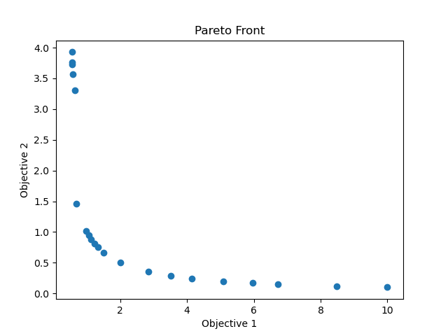
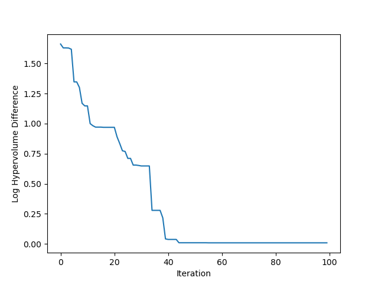

# Multi-Objective with Constraint

In this tutorial, we illustrate how to optimize constrained multiple objectives problem with **OpenBox**.

## Problem Setup

We use constrained multi-objective problem CONSTR in this example.

```python
from openbox.benchmark.objective_functions.synthetic import CONSTR

prob = CONSTR()
dim = 2
initial_runs = 2 * (dim + 1)
```

Mention that the objective function should return a <font color=#FF0000>**dict**.</font>
The result dict should contain:

+ **'objs'**: A **list/tuple** of **objective values (to be minimized)**. 
In this example, we have one objective so return a tuple contains a single value.

+ **'constraints**': A **list/tuple** of **constraint values**.
Constraints less than zero (**"<=0"**) implies feasibility.

## Run Optimization

```python
from openbox.optimizer.generic_smbo import SMBO
bo = SMBO(prob.evaluate,
          prob.config_space,
          num_objs=prob.num_objs,
          num_constraints=prob.num_constraints,
          max_runs=100,
          surrogate_type='gp',
          acq_type='ehvic',
          acq_optimizer_type='random_scipy',
          initial_runs=initial_runs,
          init_strategy='sobol',
          ref_point=prob.ref_point,
          time_limit_per_trial=10,
          task_id='moc',
          random_state=1)
bo.run()
```

Here we create a <font color=#FF0000>**SMBO**</font> object, passing the objective function and the 
configuration space to it. 

+ **num_objs** and **num_constraints** sets how many objectives and constraints the objective function will return.

+ **max_runs=100** means the optimization will take 100 rounds (100 times of objective function evaluation). 

+ **surrogate_type='gp'**. For mathematical problem, we suggest using Gaussian Process (**'gp'**) as Bayesian surrogate
model. For practical problems such as hyperparameter optimization (HPO), we suggest using Random Forest (**'prf'**).

+ **acq_type='ehvic'**. Use **EHVIC(Expected Hypervolume Improvement with Constraint)**
as Bayesian acquisition function.

+ **acq_optimizer_type='random_scipy'**. For mathematical problem, we suggest using **'random_scipy'** as
acquisition function optimizer. For practical problems such as hyperparameter optimization (HPO), we suggest
using **'local_random'**.

+ **initial_runs** sets how many configurations are suggested by **init_strategy** before the optimization loop.

+ **init_strategy='sobol'** sets the strategy to suggest the initial configurations.

+ **ref_point** specifies the reference point, which is the upper bound on the objectives used for computing
hypervolume. If using EHVI method, a reference point must be provided. In practice the reference point can be
set 1) using domain knowledge to be slightly worse than the upper bound of objective values, where the upper bound is
the maximum acceptable value of interest for each objective, or 2) using a dynamic reference point selection strategy.

+ **time_limit_per_trial** sets the time budget (seconds) of each objective function evaluation. Once the 
evaluation time exceeds this limit, objective function will return as a failed trial.

+ **task_id** is set to identify the optimization process.

Then, call <font color=#FF0000>**bo.run()**</font> to start the optimization process and wait for the result to return.

For detailed usage of **SMBO**, please see our [Manual](../manual/manual)

## Observe Optimization Results

Since we optimize every objective at the same time, we will get a pareto front as results.
Call <font color=#FF0000>**bo.get_history().get_pareto_front()**</font> to get the pareto front.

```python
import numpy as np
import matplotlib.pyplot as plt
# plot pareto front
pareto_front = np.asarray(bo.get_history().get_pareto_front())
if pareto_front.shape[-1] in (2, 3):
    if pareto_front.shape[-1] == 2:
        plt.scatter(pareto_front[:, 0], pareto_front[:, 1])
        plt.xlabel('Objective 1')
        plt.ylabel('Objective 2')
    elif pareto_front.shape[-1] == 3:
        ax = plt.axes(projection='3d')
        ax.scatter3D(pareto_front[:, 0], pareto_front[:, 1], pareto_front[:, 2])
        ax.set_xlabel('Objective 1')
        ax.set_ylabel('Objective 2')
        ax.set_zlabel('Objective 3')
    plt.title('Pareto Front')
    plt.show()
```



Then plot the hypervolume difference during the optimization compared to the ideal pareto front.

```python
# plot hypervolume
hypervolume = bo.get_history().hv_data
max_hv = 92.02004226679216
log_hv_diff = np.log10(max_hv - np.asarray(hypervolume))
plt.plot(log_hv_diff)
plt.xlabel('Iteration')
plt.ylabel('Log Hypervolume Difference')
plt.show()
```



