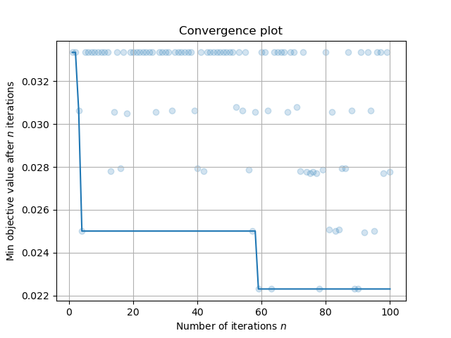

# Single Objective Hyperparameter Optimization

This tutorial will guide you on how to tune hyperparameters of ML task with **OpenBox**.

## Prepare Data

First, **prepare data** for your ML model. Here we use digits dataset from sklearn as an example.

```python
# prepare your data
from sklearn.model_selection import train_test_split
from sklearn.datasets import load_digits

X, y = load_digits(return_X_y=True)
x_train, x_test, y_train, y_test = train_test_split(X, y, test_size=0.2, stratify=y, random_state=1)
```

## Problem Setup

Second, **define configuration space** to search and **define objective function**
to <font color=#FF0000>**minimize**</font>.

We use [LightGBM](https://lightgbm.readthedocs.io/en/latest/), a gradient boosting framework developed by Microsoft,
as classification model.

```python
from openbox.utils.config_space import ConfigurationSpace, Configuration
from openbox.utils.config_space import UniformFloatHyperparameter, \
    CategoricalHyperparameter, Constant, UniformIntegerHyperparameter
from sklearn.metrics import balanced_accuracy_score
from lightgbm import LGBMClassifier


def get_configspace():
    cs = ConfigurationSpace()
    n_estimators = UniformIntegerHyperparameter("n_estimators", 100, 1000, default_value=500, q=50)
    num_leaves = UniformIntegerHyperparameter("num_leaves", 31, 2047, default_value=128)
    max_depth = Constant('max_depth', 15)
    learning_rate = UniformFloatHyperparameter("learning_rate", 1e-3, 0.3, default_value=0.1, log=True)
    min_child_samples = UniformIntegerHyperparameter("min_child_samples", 5, 30, default_value=20)
    subsample = UniformFloatHyperparameter("subsample", 0.7, 1, default_value=1, q=0.1)
    colsample_bytree = UniformFloatHyperparameter("colsample_bytree", 0.7, 1, default_value=1, q=0.1)
    cs.add_hyperparameters([n_estimators, num_leaves, max_depth, learning_rate, min_child_samples, subsample,
                            colsample_bytree])
    return cs


def objective_function(config: Configuration):
    params = config.get_dictionary()
    params['n_jobs'] = 2
    params['random_state'] = 47

    model = LGBMClassifier(**params)
    model.fit(x_train, y_train)
    y_pred = model.predict(x_test)

    loss = 1 - balanced_accuracy_score(y_test, y_pred)  # minimize
    return dict(objs=(loss, ))
```

Additional instructions for **defining configuration (hyperparameter) space**
using [ConfigSpace](https://automl.github.io/ConfigSpace/master/index.html):

+ When we define **n_estimators**, we set **q=50**,
which means the values of the hyperparameter will be sampled at an interval of 50.

+ When we define **learning_rate**, we set **log=True**,
which means the values of the hyperparameter will be sampled on a logarithmic scale.

The input of the **objective function** is a **Configuration** object sampled from **ConfigurationSpace**.
Call <font color=#FF0000>**config.get_dictionary()**</font> to covert **Configuration** to Python **dict** form.

In the hyperparameter optimization task, once a new configuration of hyperparameter is suggested,
we retrain the model and make predictions to evaluate the performance of the model on this configuration.
These steps are carried out in the objective function.

After evaluation, the objective function should return a <font color=#FF0000>**dict (Recommended)**.</font>
The result dict should contain:

+ **'objs'**: A **list/tuple** of **objective values (to be minimized)**. 
In this example, we have one objective so return a tuple contains a single value.

+ **'constraints**': A **list/tuple** of **constraint values**.
If the problem is not constrained, return **None** or do not include this key in the dict.
Constraints less than zero (**"<=0"**) implies feasibility.

In addition to the recommended usage, for single objective problem with no constraint,
just return a single value is supported, too.

## Run Optimization

After we define the configuration space and the objective function, we could run optimization process,
search over the configuration space and try to find <font color=#FF0000>**minimum**</font> value of the objective.

```python
from openbox.optimizer.generic_smbo import SMBO

# Run Optimization
bo = SMBO(objective_function,
          get_configspace(),
          num_objs=1,
          num_constraints=0,
          max_runs=100,
          surrogate_type='prf',
          time_limit_per_trial=180,
          task_id='so_hpo')
history = bo.run()
```

Here we create a <font color=#FF0000>**SMBO**</font> object, passing the objective function and the 
configuration space to it. 

+ **num_objs=1** and **num_constraints=0** indicates our function returns a single objective value with no constraint. 

+ **max_runs=100** means the optimization will take 100 rounds (100 times of objective function evaluation). 

+ **surrogate_type='prf'**. For mathematical problem, we suggest using Gaussian Process (**'gp'**) as Bayesian surrogate
model. For practical problems such as hyperparameter optimization (HPO), we suggest using Random Forest (**'prf'**).

+ **time_limit_per_trial** sets the time budget (seconds) of each objective function evaluation. Once the 
evaluation time exceeds this limit, objective function will return as a failed trial.

+ **task_id** is set to identify the optimization process.

Then, call <font color=#FF0000>**bo.run()**</font> to start the optimization process and wait for the result to return.

For detailed usage of **SMBO**, please see our [Manual](../manual/manual)

## Observe Optimization Results

**bo.run()** will return the optimization history. Or you can call 
<font color=#FF0000>**bo.get_history()**</font> to get the history.

Call <font color=#FF0000>**print(history)**</font> to see the result:

```python
history = bo.get_history()
print(history)
```

```
+------------------------------------------------+
| Parameters              | Optimal Value        |
+-------------------------+----------------------+
| colsample_bytree        | 0.800000             |
| learning_rate           | 0.018402             |
| max_depth               | 15                   |
| min_child_samples       | 15                   |
| n_estimators            | 200                  |
| num_leaves              | 723                  |
| subsample               | 0.800000             |
+-------------------------+----------------------+
| Optimal Objective Value | 0.022305877305877297 |
+-------------------------+----------------------+
| Num Configs             | 100                  |
+-------------------------+----------------------+
```

Call <font color=#FF0000>**history.plot_convergence()**</font> to see the optimization process
(you may need to call **plt.show()** to see the graph):

```python
history.plot_convergence()
```



In Jupyter Notebook environment, call <font color=#FF0000>**history.visualize_jupyter()**</font> to visualization of 
trials using **hiplot**:

```python
history.visualize_jupyter()
```


