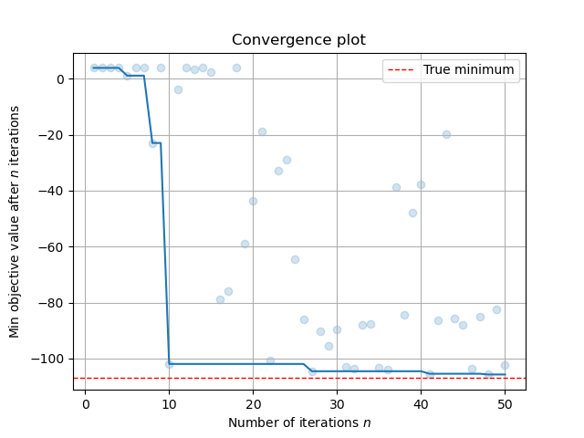

# Single Objective with Constraint

In this tutorial, we illustrate how to optimize a constrained problem with **Open-Box**.

## Define Configuration Space and Objective Function

First, **define configuration space** to search and **define objective function**
to <font color=#FF0000>**minimize**</font>. Here we use the constrained **Mishra** function.

```python
import numpy as np
from litebo.utils.config_space import ConfigurationSpace, UniformFloatHyperparameter

def mishra(config):
    config_dict = config.get_dictionary()
    X = np.array([config_dict['x%d' % i] for i in range(2)])
    x, y = X[0], X[1]
    t1 = np.sin(y) * np.exp((1 - np.cos(x))**2)
    t2 = np.cos(x) * np.exp((1 - np.sin(y))**2)
    t3 = (x - y)**2

    result = dict()
    result['objs'] = [t1 + t2 + t3, ]
    result['constraints'] = [np.sum((X + 5)**2) - 25, ]
    return result

params = {
    'float': {
        'x0': (-10, 0, -5),
        'x1': (-6.5, 0, -3.25)
    }
}
cs = ConfigurationSpace()
cs.add_hyperparameters([UniformFloatHyperparameter(name, *para)
                        for name, para in params['float'].items()])
```

Mention that the objective function should return a <font color=#FF0000>**dict**.</font>
The result dict should contain:

+ **'objs'**: A **list/tuple** of **objective values (to be minimized)**. 
In this example, we have one objective so return a tuple contains a single value.

+ **'constraints**': A **list/tuple** of **constraint values**.
Constraints less than zero (**"<=0"**) implies feasibility.

## Run Optimization

After we define the configuration space and the objective function, we could run optimization process,
search over the configuration space and try to find <font color=#FF0000>**minimum**</font> value of the objective.

```python
from litebo.optimizer.generic_smbo import SMBO

bo = SMBO(mishra,
          cs,
          num_constraints=1,
          num_objs=1,
          acq_optimizer_type='random_scipy',
          max_runs=50,
          time_limit_per_trial=10,
          task_id='soc')
history = bo.run()
```

Here we create a <font color=#FF0000>**SMBO**</font> object, passing the objective function and the 
configuration space to it. 

+ **num_objs=1** and **num_constraints=1** indicates our function returns a single objective value with one constraint. 

+ **max_runs=50** means the optimization will take 50 rounds (50 times of objective function evaluation). 

+ **time_limit_per_trial** sets the time budget (seconds) of each objective function evaluation. Once the 
evaluation time exceeds this limit, objective function will return as a failed trial.

+ **task_id** is set to identify the optimization process.

Then, call <font color=#FF0000>**bo.run()**</font> to start the optimization process and wait for the result to return.

For detailed usage of **SMBO**, please see our [Manual](../manual/manual)

## Observe Optimization Results

**bo.run()** will return the optimization history. Or you can call 
<font color=#FF0000>**bo.get_history()**</font> to get the history.

Call <font color=#FF0000>**print(history)**</font> to see the result:

```python
history = bo.get_history()
print(history)
```

```
+-----------------------------------------------+
| Parameters              | Optimal Value       |
+-------------------------+---------------------+
| x0                      | -3.172421           |
| x1                      | -1.506397           |
+-------------------------+---------------------+
| Optimal Objective Value | -105.72769850551406 |
+-------------------------+---------------------+
| Num Configs             | 50                  |
+-------------------------+---------------------+
```

Call <font color=#FF0000>**history.plot_convergence()**</font> to see the optimization process
(you may need to call **plt.show()** to see the graph):

```python
history.plot_convergence(true_minimum=-106.7645367)
```



